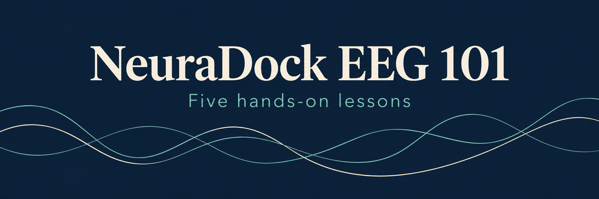
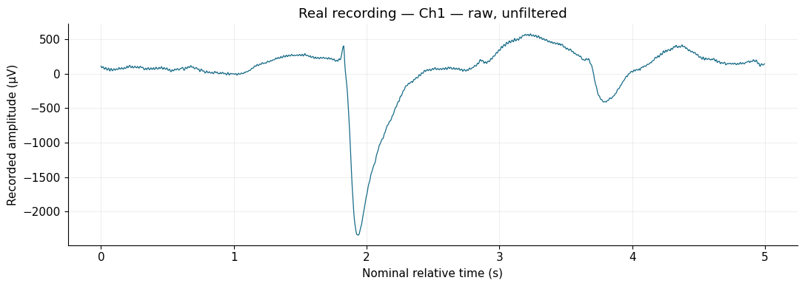
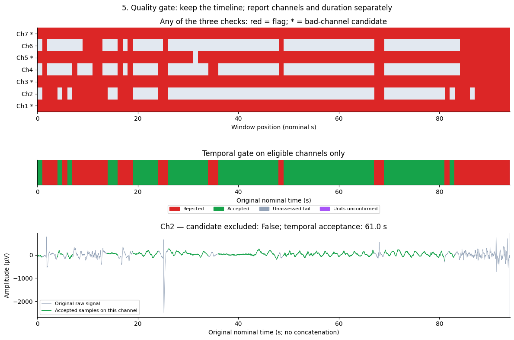
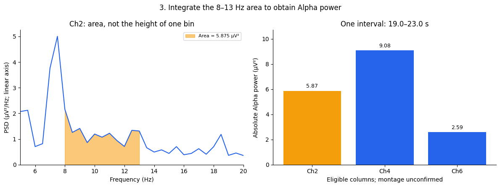

<h1 align="center">
  
</h1>

<p align="center">
  From neural signals to Alpha features.<br>
  Understand a signal model, explore a real recording, and learn to check quality before interpreting EEG.
</p>

<p align="center">
  <strong>5 lessons</strong> &nbsp; · &nbsp; <strong>Notebooks with saved results</strong> &nbsp; · &nbsp; <strong>Lessons 1–4 need no hardware</strong>
</p>

<p align="center">
  <strong><a href="notebooks/01-how-spikes-become-an-eeg-like-signal.ipynb">Start Lesson 1 →</a></strong>
  &nbsp; · &nbsp; <a href="#run-in-vs-code">Run locally</a>
  &nbsp; · &nbsp; <a href="#for-teachers">Teaching materials</a>
</p>

<p align="center"><sub>For academic and non-commercial use · <a href="LICENSE.md">License</a></sub></p>

## See what you will learn

These are actual saved notebook outputs from the bundled, owner-approved recording. Open any preview to explore its lesson, code, and full-size figures.

| Read a recording | Check its quality | Measure Alpha power |
| :---: | :---: | :---: |
| [](notebooks/02-read-and-plot-your-neuradock-data.ipynb) | [](notebooks/03-three-artifact-checks-one-quality-gate.ipynb) | [](notebooks/04-from-eeg-to-features-understanding-alpha-power.ipynb) |
| Turn a text file into readable waveforms. | See which data can enter the analysis. | Extract a feature from accepted data. |
| [**Lesson 2 →**](notebooks/02-read-and-plot-your-neuradock-data.ipynb) | [**Lesson 3 →**](notebooks/03-three-artifact-checks-one-quality-gate.ipynb) | [**Lesson 4 →**](notebooks/04-from-eeg-to-features-understanding-alpha-power.ipynb) |

*Recording replay, not live acquisition. Historical electrode positions and experimental conditions are unconfirmed; the lessons use `Ch1`–`Ch7`. [About the teaching data](data/teaching/lesson-02/README.md).*

## The five lessons

**Signal formation → Read data → Check quality → Extract Alpha → Explore the Agent**

Follow the notebooks in order. Each combines explanation, executable code, and saved example results; the tutorials are optional reading companions.

| Lesson | What you will learn | Learning materials |
| --- | --- | --- |
| **01 · How Spikes Become an EEG-Like Signal** | Follow spikes through responses and a signed population sum. *Simulation; arbitrary units.* | [**Notebook →**](notebooks/01-how-spikes-become-an-eeg-like-signal.ipynb)<br>[Tutorial](tutorials/lesson-01-from-synchronized-neurons-to-measurable-eeg.md) |
| **02 · Read and Plot Your NeuraDock Data** | Parse a real text recording and plot its seven signal columns. | [**Notebook →**](notebooks/02-read-and-plot-your-neuradock-data.ipynb)<br>[Tutorial](tutorials/lesson-02-inside-a-neuradock-recording.md) |
| **03 · Three Artifact Checks, One Quality Gate** | Apply three artifact checks and preserve rejected time intervals. | [**Notebook →**](notebooks/03-three-artifact-checks-one-quality-gate.ipynb)<br>[Tutorial](tutorials/lesson-03-signal-quality-before-interpretation.md) |
| **04 · From EEG to Features: Understanding Alpha Power** | Estimate Welch PSD and absolute 8–13 Hz Alpha power from accepted continuous data. | [**Notebook →**](notebooks/04-from-eeg-to-features-understanding-alpha-power.ipynb)<br>[Tutorial](tutorials/lesson-04-filtering-psd-and-posterior-alpha.md) |
| **05 · From Alpha Features to the NeuraDock Agent** | Move from offline features to a supervised live Alpha observation with the official Agent. | [**Notebook →**](notebooks/05-from-alpha-features-to-the-neuradock-agent.ipynb)<br>[Tutorial](tutorials/lesson-05-comparing-conditions-without-overclaiming.md) |

> **Start with what you have.** You can read the saved results directly on GitHub without installing anything. Lessons 1–4 run with no device and no separate data download. Lesson 5's notebook runs without hardware; its saved output is an environment check and a blank observation sheet. The live observation requires a NeuraDock device and a separate Agent installation.

## Run in VS Code

You will need **Python 3.10+**, **Git**, and **VS Code** with the **Python** and **Jupyter** extensions. Basic familiarity with Python will help you follow and modify the code.

**1. Get the course and install its environment.** Run these commands in a terminal:

<details open>
<summary><strong>Windows · PowerShell</strong></summary>

```powershell
git clone https://github.com/Neuradock/neuradock-eeg-101.git
cd neuradock-eeg-101
python -m venv .venv
.\.venv\Scripts\python.exe -m pip install -e ".[notebooks]"
```

</details>

<details>
<summary><strong>macOS / Linux</strong></summary>

```bash
git clone https://github.com/Neuradock/neuradock-eeg-101.git
cd neuradock-eeg-101
python3 -m venv .venv
./.venv/bin/python -m pip install -e ".[notebooks]"
```

</details>

**2. Open the course folder.** In VS Code, choose **File → Open Folder** and select the cloned `neuradock-eeg-101` folder.

**3. Run your first notebook.** Open [Lesson 1](notebooks/01-how-spikes-become-an-eeg-like-signal.ipynb), choose **Select Kernel → Python Environments → .venv**, and select **Run All**. Continue with Lessons 2–5 to create your own results. Generated figures and summaries go into the ignored `outputs/` folder.

<details>
<summary>Optional: check the installation or run all five notebooks from the terminal</summary>

Use the course environment's Python:

```powershell
.\.venv\Scripts\python.exe -m unittest discover -s tests -q
.\.venv\Scripts\python.exe scripts\execute_notebooks.py
```

On macOS/Linux:

```bash
./.venv/bin/python -m unittest discover -s tests -q
./.venv/bin/python scripts/execute_notebooks.py
```

</details>

## For teachers

Use the five notebooks as the course sequence and the slides to introduce concepts and discuss results.

| Resource | Included |
| --- | --- |
| [**Complete five-lesson lecture deck**](slides/00-neuradock-eeg-101-five-lesson-lecture.pptx) | 30 editable slides with result charts and speaker notes covering Lessons 1–5. |
| [Lesson 1 companion deck](slides/01-from-synchronized-neurons-to-measurable-eeg.pptx) | 10 slides on synchronized neurons and measurable signals. |
| [Teaching recordings and provenance](data/teaching/lesson-02/README.md) | Two owner-approved recordings; Lessons 2–4 use `recording-01.txt` by default. |

Plan Lessons 1–4 around the bundled data. For Lesson 5's live activity, arrange a shared NeuraDock device and install the [EEG Workstation Agent](https://github.com/Neuradock/eeg-workstation-agent) in its own environment.

## How this repository fits with the others

**Start here for the course.** Use the neighboring repositories when you want reusable tools, more recordings, standalone experiments, or the live application.

| Repository | Use it for |
| --- | --- |
| **NeuraDock EEG 101 · this course** | Five sequenced lessons, teaching notebooks, approved example data, and lecture materials. |
| [`eeg-workstation-python`](https://github.com/Neuradock/eeg-workstation-python) | General Python reading and analysis tools outside the lesson sequence. |
| [`eeg-workstation-examples`](https://github.com/Neuradock/eeg-workstation-examples) | Standalone EEG experiment and application examples. |
| [`eeg-workstation-data`](https://github.com/Neuradock/eeg-workstation-data) | Additional public recordings and their provenance. |
| [`eeg-workstation-agent`](https://github.com/Neuradock/eeg-workstation-agent) | The separate real-time application used in Lesson 5. |

## Data and interpretation

Lesson 1 is a deterministic teaching simulation. Lessons 2–4 replay an existing human EEG recording and report sensor-column observations. Alpha power is a signal feature, not a diagnosis or a relaxation score.

The bundled data use **250 Hz** sampling and owner-confirmed **µV** values. Historical electrode positions and experimental conditions are not established, so the lessons preserve the file's column order and use `Ch1`–`Ch7`. [Data provenance and file hashes →](data/teaching/lesson-02/README.md)

Lesson 5's optional **SYNTHETIC DEMO** previews the Agent UI only. A supervised live experiment requires a connected device, fresh samples, and acceptable signal quality. This release does not claim live hardware validation. Read the [scientific boundaries](docs/SCIENTIFIC_BOUNDARIES.md) and [data policy](data/README.md) before adapting a lesson to a study.

<details>
<summary>Maintainers: refresh the published examples</summary>

After checking the teaching-data provenance, refresh the outputs and review the resulting notebooks and homepage previews before committing.

Windows:

```powershell
.\.venv\Scripts\python.exe scripts\publish_notebook_outputs.py
.\.venv\Scripts\python.exe scripts\export_homepage_figures.py
```

macOS/Linux:

```bash
./.venv/bin/python scripts/publish_notebook_outputs.py
./.venv/bin/python scripts/export_homepage_figures.py
```

The export script copies selected saved notebook figures into `figures/homepage/`; it does not change the recording or analysis.

</details>

## Hardware, license, and contact

**Continue with your own recording.** Use a NeuraDock device with the [EEG Workstation Agent](https://github.com/Neuradock/eeg-workstation-agent) for Lesson 5's supervised live Alpha experiment. Your university may provide a shared device. [Subscribe on Crowd Supply for hardware launch updates →](https://www.crowdsupply.com/neuradock/neuradock-eeg-workstation) The Crowd Supply page offers updates, not immediate purchase or device access.

**License:** academic and non-commercial use only. Commercial use needs a separate license; see [LICENSE.md](LICENSE.md). The course is source-available, not OSI open source. The vendored quality-check code retains its separate MIT license.

For classroom kits or commercial licensing, contact [business@neuradock.com](mailto:business@neuradock.com).
