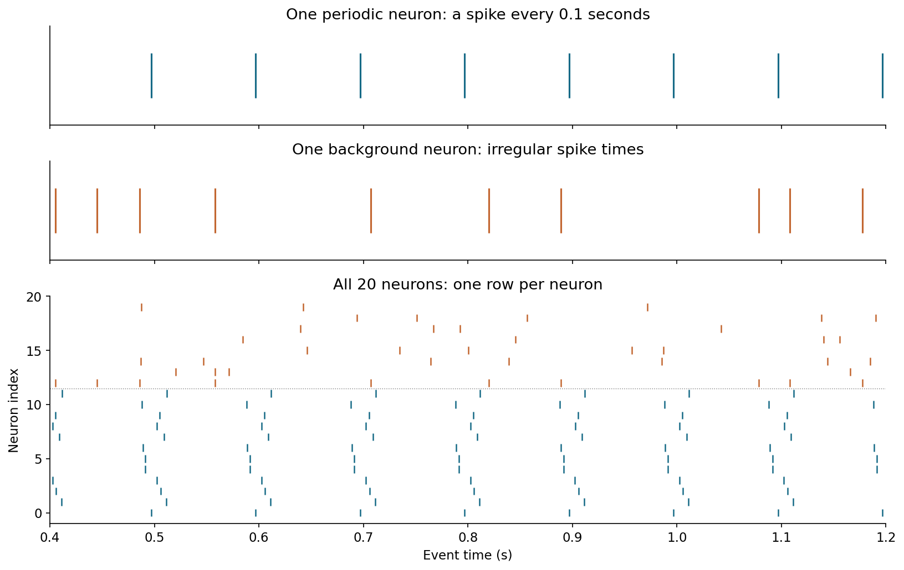
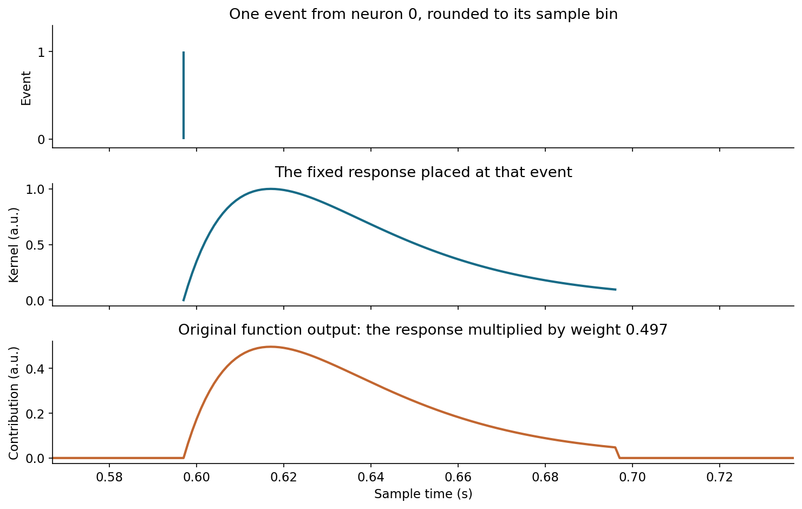
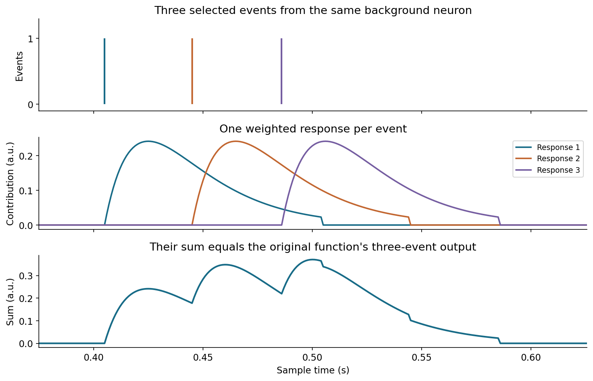
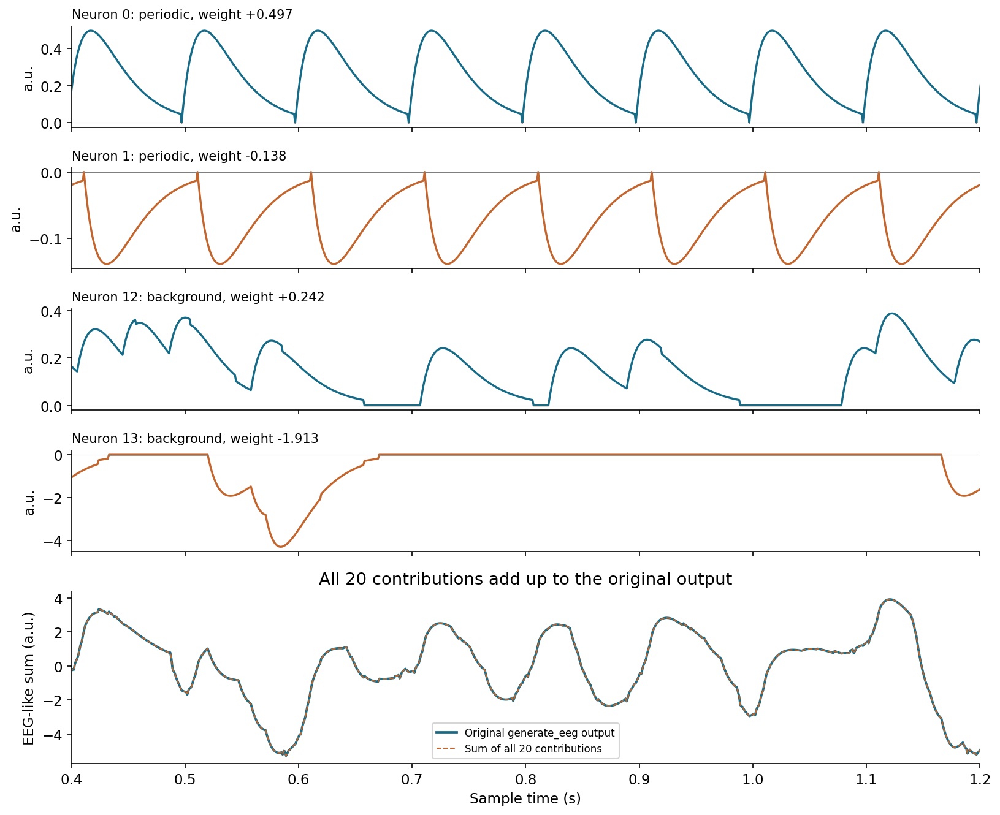
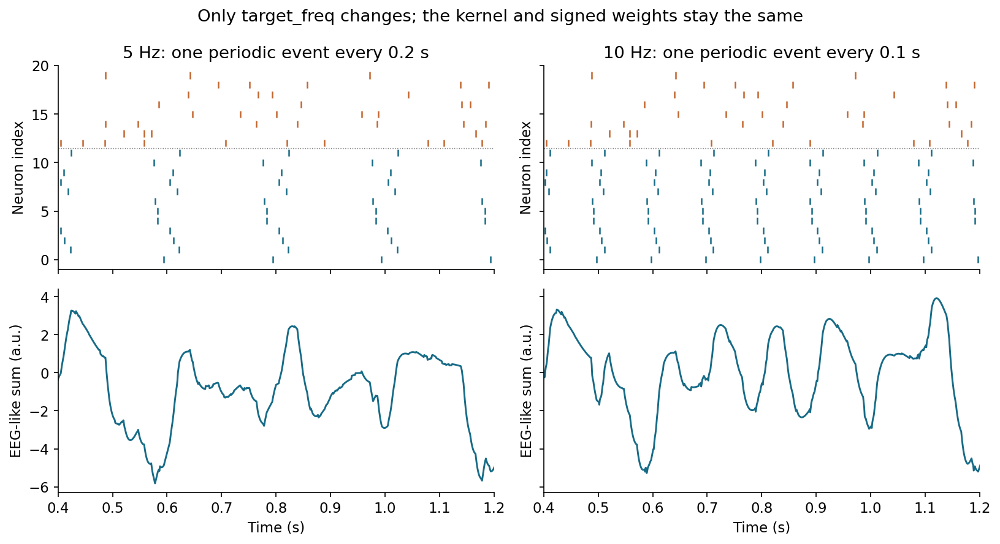
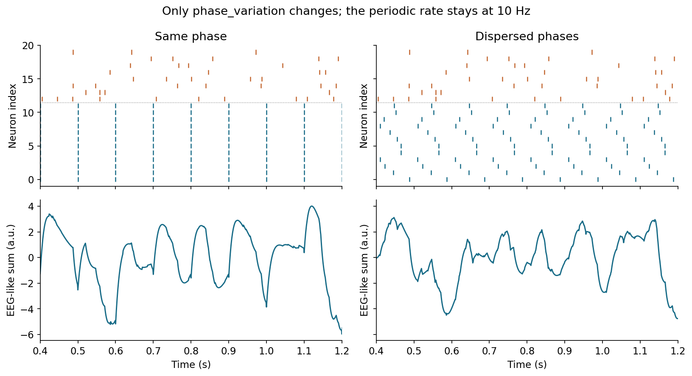

# Lesson 1 — How Spikes Become an EEG-Like Signal

**Type:** Core<br>
**Mode:** `simulation`<br>
**Suggested time:** 60 minutes<br>
**Prerequisite:** [Set up the course environment](../README.md#run-in-vs-code)

[Executable notebook](../notebooks/01-how-spikes-become-an-eeg-like-signal.ipynb) · [10-slide lecture deck](../slides/01-from-synchronized-neurons-to-measurable-eeg.pptx) · [Source provenance](../docs/spike2eeg-source.json)

> **Scientific boundary:** this lesson produces one synthetic trace at 1000 Hz in arbitrary units (`a.u.`). The inherited function is named `generate_eeg`, but its output is not recorded EEG, a calibrated scalp voltage, or a NeuraDock channel. It contains no head model, electrode geometry, reference, or device stage. NeuraDock-format recordings begin in Lesson 2.

## Learning objectives

By the end of this lesson, you should be able to:

1. distinguish periodic spike trains from background spike trains in a raster;
2. trace one spike through the fixed response kernel to one neuron's contribution;
3. explain how signed neuronal contributions add and sometimes cancel; and
4. describe what changes in simple frequency and phase-dispersion comparisons without turning the simulation into a claim about human EEG.

## The 60-minute question

How do lists of spike times become one sampled waveform in the supplied model?

The notebook keeps the two original functions unchanged:

```python
simulate_spiking_neurons(...)
generate_eeg(...)
```

The first function creates spike times. The second converts every neuron's spike train into a sampled response, multiplies that response by a signed weight, and adds the weighted contributions. The lesson follows those operations in that order.

The small baseline keeps individual events visible: 20 neurons, with 12 periodic and eight background neurons, in a two-second record sampled at 1000 Hz. The spike and weight seeds are both 42. The notebook labels the remaining timing settings beside the relevant figures.

Do not edit the function definitions during the core lesson. The notebook changes call arguments only.

## 1. Run the baseline

Open `notebooks/01-how-spikes-become-an-eeg-like-signal.ipynb`, select the course Python environment, and run the cells in order. The baseline calls are equivalent to:

```python
spikes = simulate_spiking_neurons(
    N=20,
    active_num=12,
    target_freq=10,
    phase_variation=np.pi / 4,
    background_freq=5,
    duration=2,
    seed=42,
)

t, aggregate = generate_eeg(
    spikes,
    duration=2,
    sampling_rate=1000,
    seed=42,
)
```

Before reading the explanation below, look at the first figure and write down one pattern you notice.

## 2. Read the spike trains



The figure has three linked views:

1. one periodic spike train;
2. one background spike train; and
3. a raster for all 20 neurons.

The first 12 neurons are the periodic group. Each fires once per target cycle. The function gives each periodic neuron one phase offset and keeps that offset for the whole record. The remaining eight neurons draw successive inter-spike intervals from an exponential distribution.

### Observe

- Is the spacing within the periodic example approximately constant?
- Does the background example have the same regular spacing?
- In the raster, which rows form repeated vertical bands?
- Which rows appear less regular?

The raster shows event times. It is not yet a sampled waveform.

## 3. Follow one spike into one response



`generate_eeg` first places each spike into a 1000 Hz sample grid. It then applies the same fixed, peak-normalized response kernel to every event. The kernel rises after the event, reaches its maximum about 20 ms later, and decays within its 100 ms window.

Read the panels from top to bottom:

1. one selected event after rounding to its 1000 Hz sample;
2. the fixed, peak-normalized response kernel placed at that sample; and
3. the original function's weighted response for neuron 0, using its unchanged weight of approximately `+0.497`.

### Observe

- Does the response begin before or after the event sample?
- Is the response instantaneous, or does it extend over time?
- Which property belongs to the spike train, and which belongs to the fixed kernel?

This response is a teaching kernel in the supplied code. It is not a calibrated synapse or a scalp measurement.

## 4. See how responses add within one neuron



Every spike creates a shifted copy of the same response. The notebook selects three closely spaced events that actually occurred in background neuron 12. Their response copies add where they overlap.

This is what convolution does in the model, but you do not need a frequency-domain formula to read the picture. Follow one event downward to its response, then compare the individual responses with their summed trace.

### Observe

- Where do two responses overlap?
- What happens to the summed trace in that interval?
- Does a neuron with more events automatically produce a larger value at every moment?

## 5. Add signed neuronal contributions



The function draws one fixed weight for each neuron from a normal distribution. Some weights are positive and some are negative. A neuron's unweighted response is multiplied by its weight to make that neuron's contribution. The figure displays neurons 0, 1, 12, and 13 as examples, then compares the original output with the sum of all 20 contributions.

The final aggregate is the sample-by-sample sum of all 20 weighted contributions:

```text
final aggregate = contribution 1 + contribution 2 + ... + contribution 20
```

Positive and negative contributions can reinforce or cancel one another. The signs are mathematical weights in this model. Do not relabel them as excitatory versus inhibitory cells or as anatomical source orientations.

### Observe

- Find one positive and one negative contribution. How does the weight change the response?
- Find an interval where large contributions partly cancel.
- Does the final trace look like any single neuron's response?
- Why can more closely timed spikes fail to produce a larger signed sum?

## 6. Run two small comparisons

These comparisons keep the population size, duration, sample rate, and declared seeds fixed. They are demonstrations of the supplied program, not experiments on people.

### A. Target frequency: 5 Hz versus 10 Hz



Changing `target_freq` changes the spacing of the prescribed periodic spikes. At 5 Hz, neighboring periodic events are about 0.2 seconds apart. At 10 Hz, they are about 0.1 seconds apart.

Look first at the event spacing, then at the two aggregates.

- Which condition has more target cycles in two seconds?
- Can you see the spacing change in the periodic spike rows?
- Does the signed aggregate preserve every difference in an obvious way?

Do not turn this comparison into an Alpha claim. The code imposes the frequencies; they do not emerge from a biological network.

### B. Phase half-width: 0 versus `pi`



With phase half-width `0`, the periodic neurons have the same phase. With phase half-width `pi`, their fixed offsets can span a full target cycle. The offset for each neuron remains fixed across that neuron's cycles; it is between-neuron dispersion, not new jitter on every event.

- Which raster has narrower vertical bands?
- Which condition has more aligned periodic events?
- Do the signed weights make the aggregate amplitude follow alignment in a simple way?

The last question is the important boundary: greater timing alignment does not guarantee a larger signed aggregate for a particular set of weights.

## 7. Keep the six walkthrough figures

The notebook writes these files under `outputs/notebooks/lesson-01/walkthrough/`:

```text
01-spike-trains.png
02-one-spike-response.png
03-responses-add-up.png
04-weighted-population.png
05-frequency-comparison.png
06-phase-comparison.png
```

Curated copies are stored under [`figures/lesson-01-walkthrough/`](../figures/lesson-01-walkthrough/) so the tutorial remains readable without executing the notebook first.

The same output folder also contains `walkthrough.npz`, which preserves the full two-second arrays, and `summary.json`, which records the parameters, seeds, figure names, and reconstruction checks. A curated copy of that summary is stored at [`reference-results/lesson-01-walkthrough.json`](../reference-results/lesson-01-walkthrough.json).

## 8. Exit ticket

Submit the population-contribution figure with five sentences that answer:

1. What does one tick in a spike train represent?
2. Why can its contribution last longer than the event itself?
3. What happens when responses overlap?
4. Why can two neurons' weighted contributions cancel?
5. How is the final curve related to the individual contributions?

A correct answer explains the computation visible in the figure and retains the `a.u.` label. It does not need RMS, PSD, a parameter sweep, or a claim about human EEG.

## Suggested 60-minute schedule

| Time | Activity |
|---:|---|
| 0–5 min | State the question and the synthetic-data boundary. |
| 5–15 min | Run the baseline and compare periodic with background spikes. |
| 15–25 min | Trace one spike through the fixed response. |
| 25–35 min | Inspect overlapping responses within one neuron. |
| 35–45 min | Read signed contributions and their population sum. |
| 45–55 min | Compare 5 versus 10 Hz and phase `0` versus `pi`. |
| 55–60 min | Complete the exit ticket. |

You are ready for Lesson 2 when you can trace **spikes → fixed responses → signed contributions → final sum**, defend the `a.u.` label, and explain why the trace is still a simulation rather than a NeuraDock recording.

[Next: Inside a NeuraDock Recording →](lesson-02-inside-a-neuradock-recording.md)
