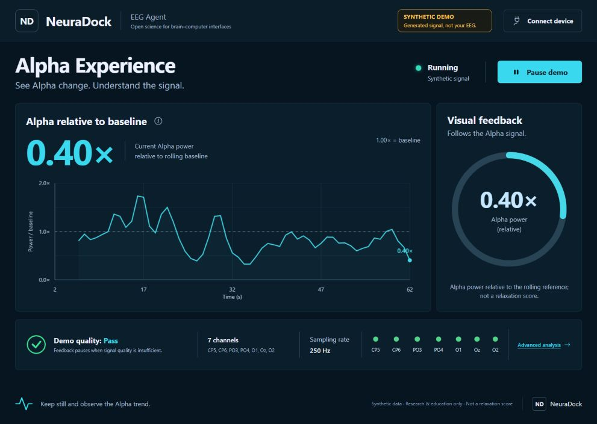

# Lesson 5 — From Alpha Features to the NeuraDock Agent

**Final core lesson · guided application lab · about 45–60 minutes**

## Start here: open the Agent

[**Open NeuraDock EEG Workstation Agent on GitHub →**](https://github.com/Neuradock/eeg-workstation-agent)

[Agent setup and documentation](https://github.com/Neuradock/eeg-workstation-agent#install) ·
[Alpha Experience guide](https://github.com/Neuradock/eeg-workstation-agent/blob/main/docs/alpha-experience.md) ·
[Open this lesson in VS Code](../notebooks/05-eyes-open-closed-alpha.ipynb) ·
[Version and method notes](../docs/lesson05-source.md)

You have already learned how signals become EEG, how to read a recording,
why quality matters, and how to measure Alpha. Now use those ideas in a complete
application. **Do not build another dashboard in this lesson.** The official
Agent is the application; this lesson is your short guide to using it.



*Actual application screenshot, not a new EEG result. The visible SYNTHETIC DEMO
badge means this example is not a person's EEG. Your live display will differ.*

### What you will do

1. Open the Agent and find its input mode, Alpha history, feedback ring, and quality strip.
2. With NeuraDock hardware, connect a confirmed stream and observe your own signal.
3. Explain one valid observation and one conclusion the display cannot support.

**Real EEG requires a real device.** This course's supported live path uses the
NeuraDock EEG Workstation. A university can provide shared laboratory devices;
students do not each need to own one. This does not imply that other EEG devices
cannot support neurofeedback.

Without hardware, the optional **SYNTHETIC DEMO** lets you inspect the interface.
It is software-generated test data, not a substitute for the real-data work in
Lessons 2–4 or for a live experiment. Report a preview as a preview.

**Notebook Run All is safe preparation only:** it prints an environment check
and a blank observation sheet. It does not install anything, open a device socket,
launch a server, generate EEG, or replay a recording. Run the terminal commands
below deliberately when you are ready. No API key or LLM is needed.

<!-- notebook:environment -->

## 1. Install the official application · 10 minutes

Open a VS Code terminal in the folder where you keep projects, outside the course
repository. Use Python **3.11 or 3.12**; the reviewed Agent supports 3.9–3.13.
Check the terminal interpreter with `python --version`; the notebook kernel
may be different.

```bash
git clone https://github.com/Neuradock/eeg-workstation-agent.git
cd eeg-workstation-agent
python -m venv .venv
git rev-parse HEAD
```

Record the Git commit in your report. If you already have an Agent checkout,
use that folder and consult its README rather than cloning over it. The lesson's
reviewed revision is documented in the method notes.

Install into the new environment. No shell activation is required:

**Windows PowerShell**

```powershell
.\.venv\Scripts\python.exe -m pip install -e .
```

**macOS / Linux**

```bash
.venv/bin/python -m pip install -e .
```

Open this Agent folder in VS Code. The commands below run from its root.
Keep the course and Agent environments separate.

## 2. Optional preview: learn the interface · 10 minutes

If the instructor has already prepared a live station, skip to Step 3.
Otherwise, deliberately start the built-in software demonstration:

**Windows PowerShell**

```powershell
.\.venv\Scripts\python.exe -m neuradock_agent serve --host 127.0.0.1 --port 8765
```

**macOS / Linux**

```bash
.venv/bin/python -m neuradock_agent serve --host 127.0.0.1 --port 8765
```

Open [http://127.0.0.1:8765](http://127.0.0.1:8765) in your browser while the
terminal stays running. This localhost address is the **dashboard**, not a
guessed device endpoint. Keep the server bound to localhost.

Locate these four parts:

| Part | Read it as |
|---|---|
| Input-mode badge | SYNTHETIC DEMO, recorded replay, or live device: where samples come from |
| Alpha history | Recent quality-gated Alpha ratios; gaps are unavailable values, not zeros |
| Feedback ring and number | The same Alpha ratio shown another way, not an extra measurement |
| Seven-channel quality strip | A reason to check the signal before interpreting the feature |

Try **Pause**, **Resume**, and the Alpha explanation. Pause freezes the displayed
history and hides current feedback; it does **not** stop live acquisition.
**Connect device** opens setup instructions and generates a terminal command;
clicking it alone does not establish a hardware connection.

Do not relabel this preview as live EEG. Press **Ctrl+C** in its terminal before
starting another server on the same dashboard port.

## 3. Connect your NeuraDock device · 10–15 minutes

This step needs the device, its acquisition/bridge software, voluntary consent,
and an instructor-confirmed stream endpoint. Verify the actual electrode setup:
250 Hz, µV, seven channels in the order **CP5, CP6, PO3, PO4, O1, Oz, O2**.
These current live labels do not retrospectively establish the montage of older
course recordings.

Obtain the exact host and port from your acquisition setup. Replace
`CONFIRMED_HOST` and `CONFIRMED_PORT` below; do not paste the placeholders
unchanged, guess a device address, or scan the network. Stop any previous Agent
server and let the instructor complete the station's transport/QC preflight.

**Windows PowerShell**

```powershell
.\.venv\Scripts\python.exe -m neuradock_agent online --ip CONFIRMED_HOST --port CONFIRMED_PORT --dashboard-port 8765
```

**macOS / Linux**

```bash
.venv/bin/python -m neuradock_agent online --ip CONFIRMED_HOST --port CONFIRMED_PORT --dashboard-port 8765
```

The Agent opens the dashboard; if needed, visit the same localhost URL manually.
Check all three conditions before interpreting a number:

- The source indicates **live device**, not synthetic demo or replay.
- Fresh samples are arriving; there is no disconnected or stale-data warning.
- Signal quality permits feedback; allow the clean-window warmup to finish.

A connected socket alone is not good EEG. If feedback is unavailable, check
contact, placement, motion, muscle tension, and the acquisition setup. Do not
change thresholds simply to obtain a favorable number.

**Optional instructor diagnostic.** The Agent's `doctor` command captures and
**saves raw EEG locally** under `runs/`, along with a report. Use it only with
permission to record and an agreed storage/deletion procedure, before starting
the live dashboard. In the Agent environment, its syntax is
`python -m neuradock_agent doctor --ip CONFIRMED_HOST --port CONFIRMED_PORT --windows 3`
(use the same platform-specific Python path as above).
Inspect valid sample counts, delivery rate, skipped lines, and quality warnings;
a delivery-rate estimate is not precise ADC-clock or end-to-end latency validation.
Keep captures private and out of GitHub.

## 4. Observe Alpha, not a “relaxation score” · 10 minutes

The connection to Lesson 4 is simple:

**EEG → quality check → posterior 8–13 Hz Alpha → rolling reference → screen feedback.**

Lesson 4 taught the feature in an offline recording. The Agent processes completed
trailing windows (normally four seconds, updated every second), so it has a recent
history requirement and is not an instantaneous reading. Its online preprocessing,
posterior channel aggregation, and acceptance rules differ from the course's
single-channel offline exercise: do not expect identical numerical results.

The displayed `posterior_alpha_relative` is Alpha power relative to a **rolling
log-median reference**. At least three clean, finite, positive-power windows are
needed. The reference uses up to 600 accepted values, including the current
accepted window. It can change while you watch; it is **not a frozen personal
calibration**, and this lesson does not add a separate 60-second calibration stage.

| Example ratio | Meaning |
|---|---|
| 1.0× | Approximately the rolling reference level |
| 1.2× | Approximately 20% higher Alpha power than that reference |
| 0.8× | Approximately 20% lower Alpha power than that reference |
| Unavailable | No valid current feedback; not zero Alpha or “poor relaxation” |

These are arithmetic examples, not measured class results. The value is neither
Alpha as a fraction of total EEG power nor a percentage of relaxation.

For a short supervised observation, sit comfortably, breathe normally, and keep
eye state, posture, and surroundings stable for about one minute. Note the source,
quality, and a few actual ratios, if available. Then repeat under the same setup.
You may note a subjective feeling separately, but do not infer it from the number.
Do not switch eye state and call the resulting change learning.

**Increasing Alpha is not required.** A moving ring is not evidence that
neurofeedback caused relaxation, learning, or a clinical benefit. Investigating
those effects needs an appropriately controlled, approved study.

To end the Agent session, press **Ctrl+C** in its terminal. Separately stop any
acquisition software you started. Stop immediately if the participant is
uncomfortable; participation is voluntary.

## 5. Finish with one observation sheet · 5 minutes

Submit a short report (about one page), not four automatically generated figures:

- Agent commit, input mode, and whether real hardware was actually used.
- Quality observations and reasons for missing feedback.
- A few real ratios if available, their interpretation, and the rolling-reference caveat.
- One limitation and one question for a future controlled experiment.

A privacy-safe screenshot is optional. For a synthetic preview, explicitly write
**simulation / synthetic demo** and make no claim about a participant. If hardware
was unavailable, write **live experiment pending**, not “live verified.”
Do not include participant names, raw EEG, or identifiable recordings.

In the notebook, the next cell prints a **blank worksheet**. Fill it from your own
observations; default `not_run` is not a result. Mark `hardware_verified` true
only after a real session with documented valid sample delivery and quality checks.

<!-- notebook:observation-sheet -->

## Your next experiment starts with a real signal

You can now connect the concepts from this course to an inspectable application.
To try your own EEG, arrange access to a NeuraDock device or a shared teaching
station, confirm the setup, and run the live steps above.

[Continue with the official Agent →](https://github.com/Neuradock/eeg-workstation-agent) ·
[Subscribe on Crowd Supply for NeuraDock hardware launch updates →](https://www.crowdsupply.com/neuradock/neuradock-eeg-workstation)

Crowd Supply currently offers a launch-update subscription, not immediate
hardware access. For a classroom kit or an existing shared device, contact
[business@neuradock.com](mailto:business@neuradock.com?subject=NeuraDock%20EEG%20101%20Classroom%20Kit).

The application remains maintained in its own repository; this course does not
duplicate its dashboard, parser, or feedback engine. Earlier standalone course
feedback code is retained as a legacy reference, not the required Lesson 5 runtime.
Teach this lesson from the notebook, this guide, and the official Agent.

[← Lesson 4](../tutorials/lesson-04-filtering-psd-and-posterior-alpha.md)
